# AWS CodeDeploy Setup Guideline

### Goal: Implement a Continuous Integration process using AWS CodeDeploy, AWS CodeBuild and AWS CodePipeline services.

## Prerequisites
- [ ] Created an GitHub account.
- [ ] Have the [aws-codedepipeline-sample-tomcat](https://github.com/yperea/aws-codedepipeline-sample-tomcat) cloned and pushed into your own repository.
- [ ] Created an AWS account.
- [ ] Created an AWS EC2 Instance with Linux Ubuntu 16 LTS and Apache Tomcat.
- [ ] [AWS CodeDeploy Agent Installed](https://docs.aws.amazon.com/codedeploy/latest/userguide/codedeploy-agent-operations-install-ubuntu.html) on the EC2 Instance.
- [ ] [Created a Service Role for AWS CodeDeploy](https://docs.aws.amazon.com/codedeploy/latest/userguide/getting-started-create-service-role.html#getting-started-create-service-role-console) in your IAM Service.
## Installation Steps

  1. Log into AWS.

  2. Search for the CodeDeploy service and select it.

  3. In the Applications pane, click on **Create application**.

  	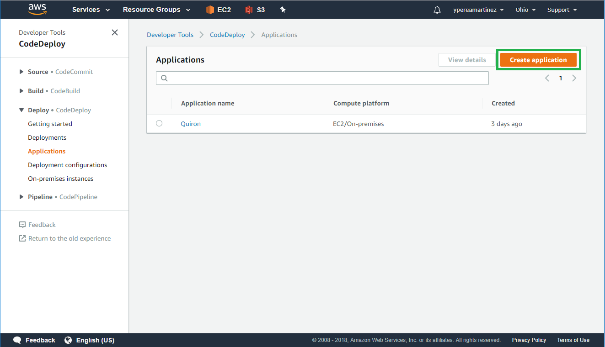

  4. On the Create application pane, enter the name for your application and select **EC2/On-premises** option as the Compute platform and then click on **Create application**.

  	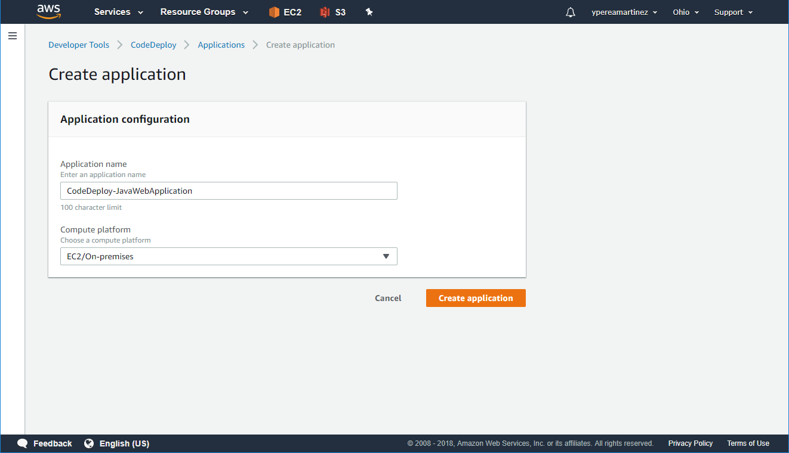

  5. You should see a confirmation message and in Application details section the configuration entered. Now a deployment group need to be created, so click on **Create deployment group** button.

  	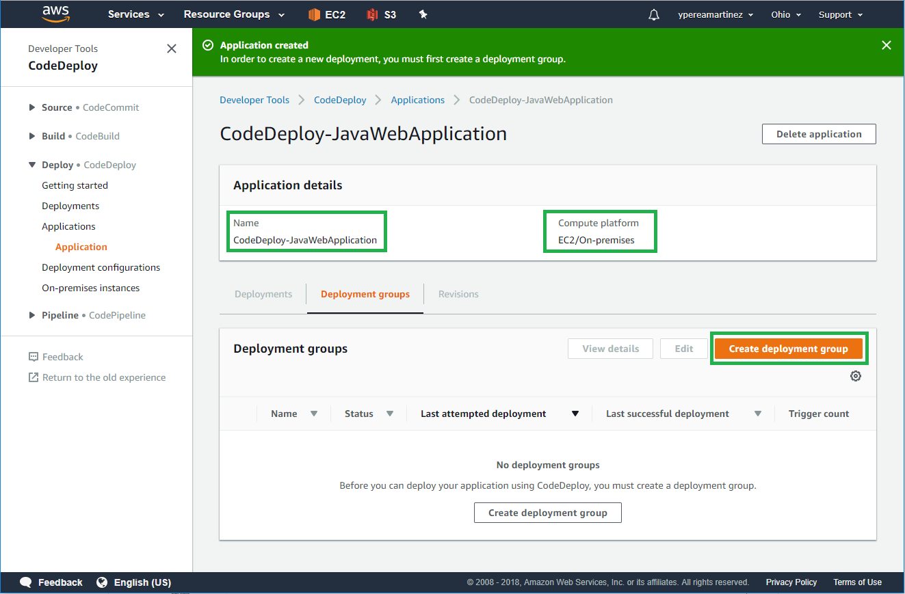

  6. Create deployment group. Enter a name for the Deployment Group and chose the service role with CodeDeploy permissions created previously. If not, create one following the intructions in this link [Creating a Service Role for AWS CodeDeploy](https://docs.aws.amazon.com/codedeploy/latest/userguide/getting-started-create-service-role.html#getting-started-create-service-role-console). After that you can continue creating the deployment group.

  	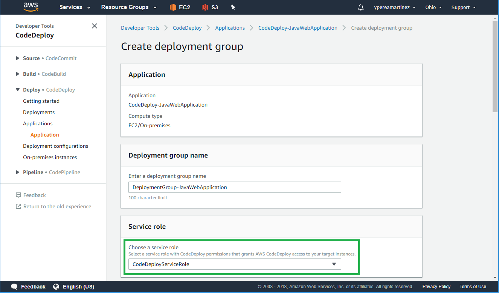

   - [ ] Because we are going to work on the same instance we need to choose **In-place** as Deployment type. Select **Amazon EC2 instances** for your **Environment configuration** *you need to have your EC2 instance tagged*.

  	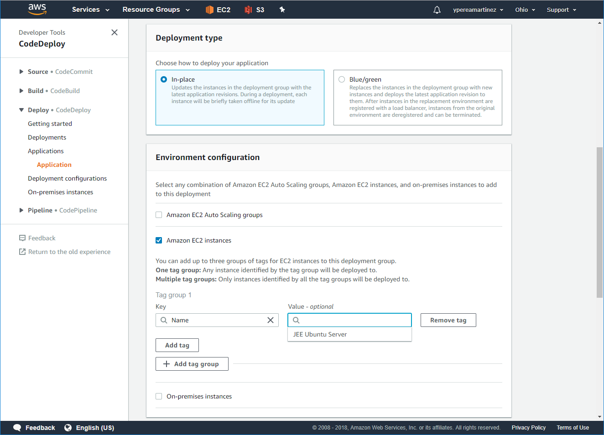

   - [ ] In **Deployment settings** choose **CodeDeployDefault.AllAtOnce** as you *Deployment configuration*. Uncheck *Enable load balancing* option in **Load balancer** pane as we are not using any load balancing configuration. Leave **Advanced** options As-Is, then click **Create deployment group**.

  	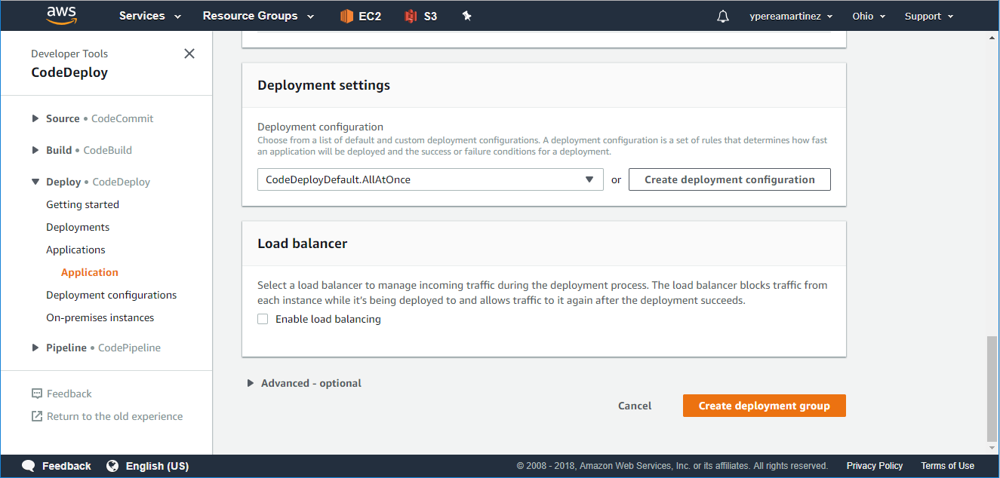

   - [ ] You should see a confirmation message and the details for the Deployment group just created. Click **Create deployment**.

	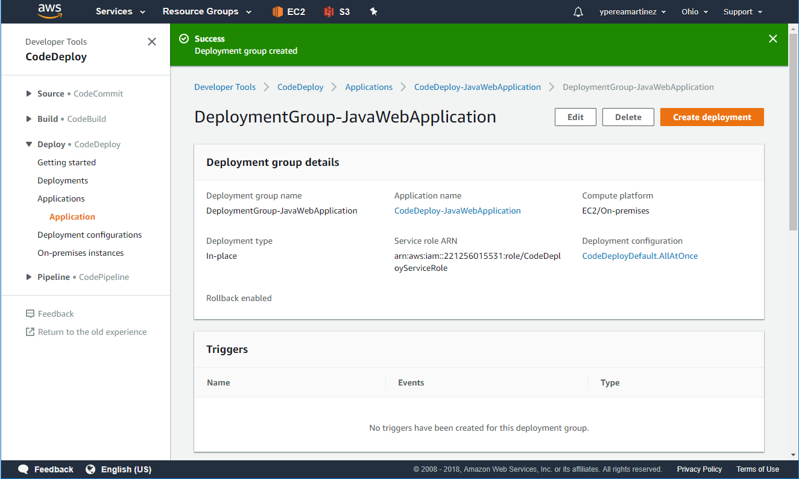

  7. Create a Deployment. Now that we have the application and a group configured we are ready to create our deployment. Verify you have the correct Deployment group selected then choose **My application is stored in GitHub** option as *Revision type*. Then you need to enter the GitHub account where is the application you are going to deploy. *To connect to a GitHub account for the first time, type an alias for the account, and then choose Connect to GitHub.*
     For Repository name you need to enter the full path name of your repository. Go to your repository and copy the name.

  	

   - [ ] Enter the Commit ID you want to deploy. In your GitHub Repository main pane click on **"commits"**.

  	

   - [ ] Then copy the *commit id* by clicking on the icon on the left of the Id.

  	

   - [ ] Your screen should looks like this.

  	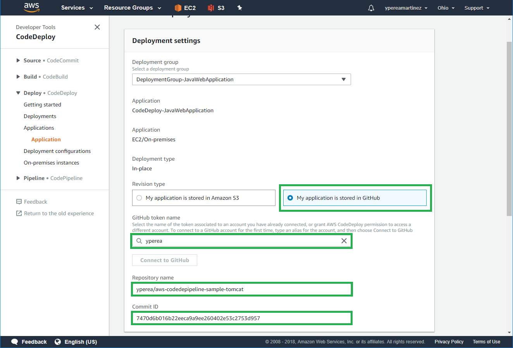

   - [ ] Check option *"Don't fail the deployment to an instance if this lifecycle event on the instance fails"*, and choose the *"Overwrite the content"* option.

  	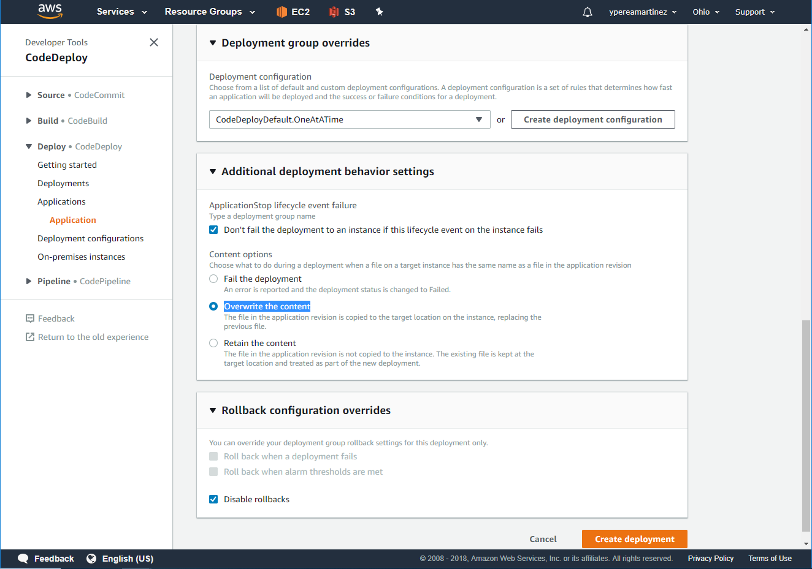

   - [ ]Leave *"Disable rollback"* option unchecked.

  8. Finally, click **Create deployment** and you will see a confirmation message.

  	

   - [ ] If process run successfully you should see a page like this.

  	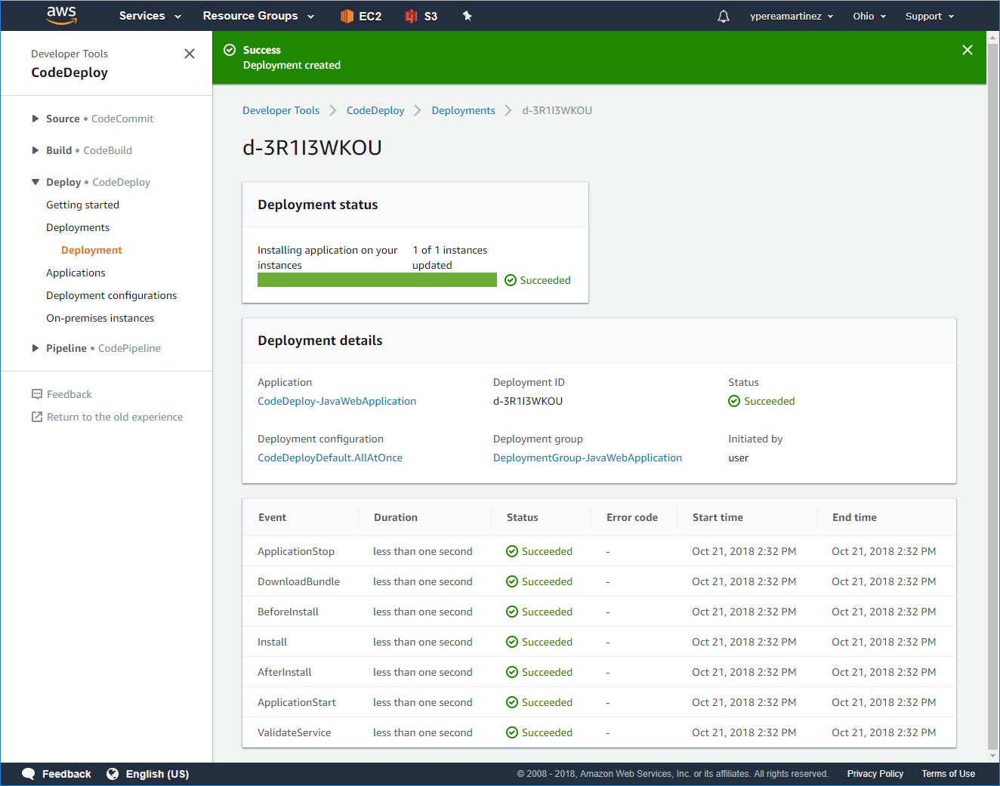

   - [ ] Now you can navigate to your instance url and verify that your application was deployed correctly.

    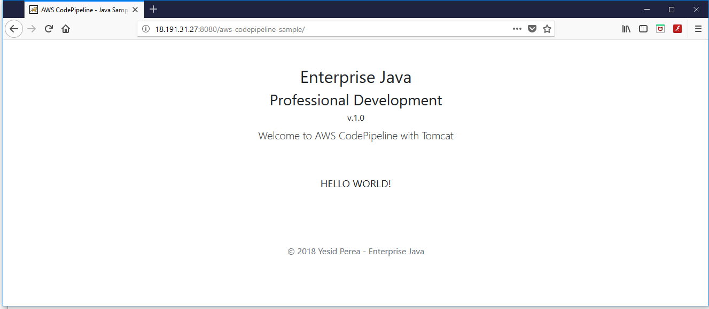

## Troubleshooting

During Deployment things could go wrong, fortunately AWS gives pretty good hints about the possible error causes.

  1. After a failed Deployment you can check the events by clicking on *View events* link on **Deployment lifecycle events** section.

  	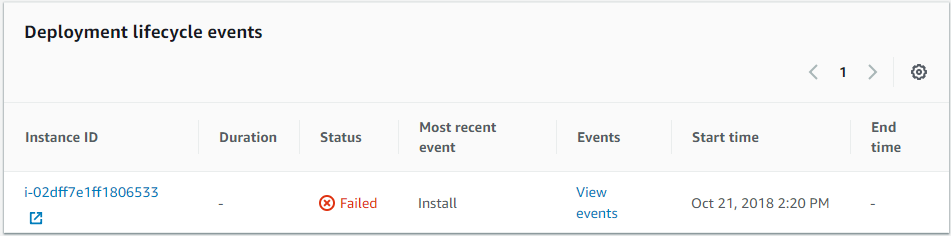

  2. Event list will show you the source of the error. For this particular example we can see that an error occurred during the package Installation. The next step is click on the UnknownError link to view the detail of this error.

  	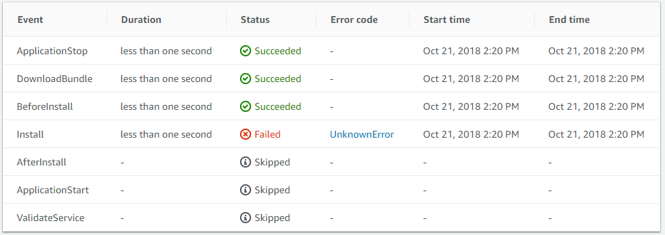

  3. **Event Details Message** describes the cause of the error.

   	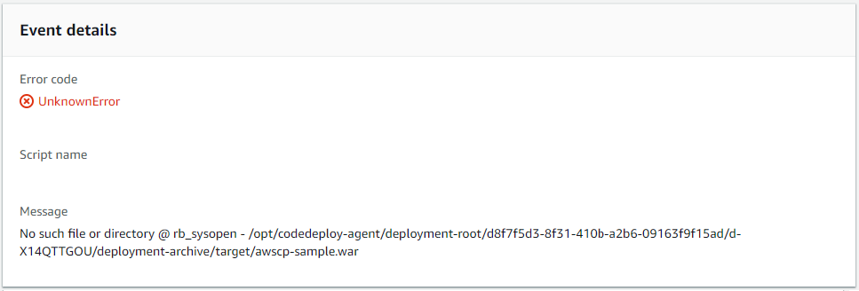

The most common causes of error during a Deployment process are:

 - Troubles finding the built artifact or war file to deploy. Mostly because in our GitHub repositories we don't push targets directories with war files.
 - Missing Permissions on AWS Service Roles, remember that at least a CodeDeploy Service Role needs to be configured.
