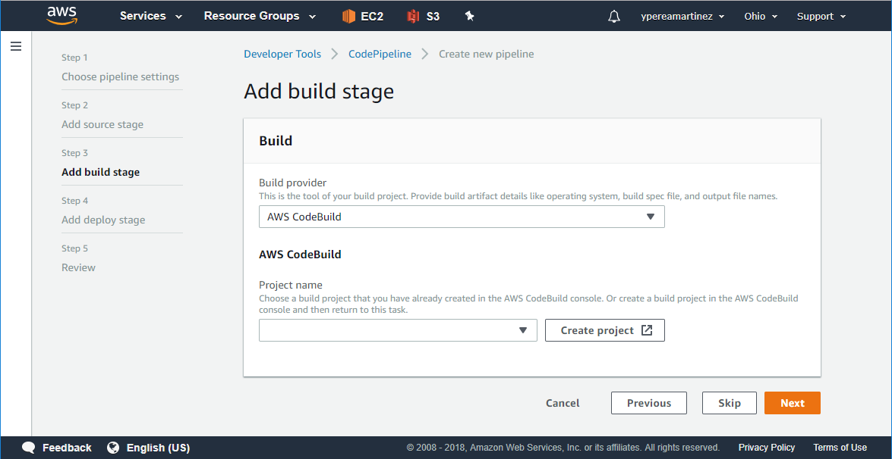
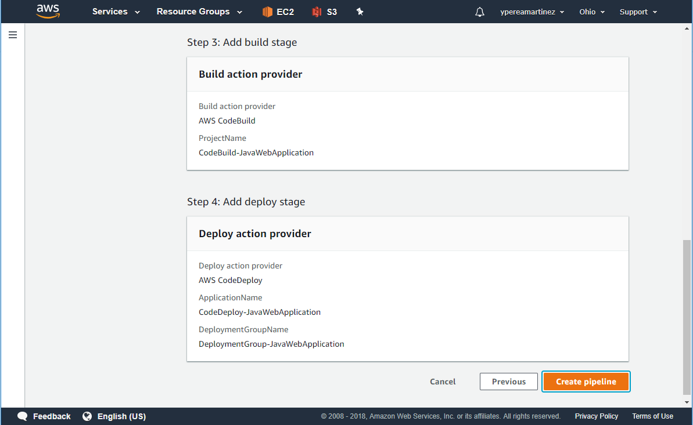
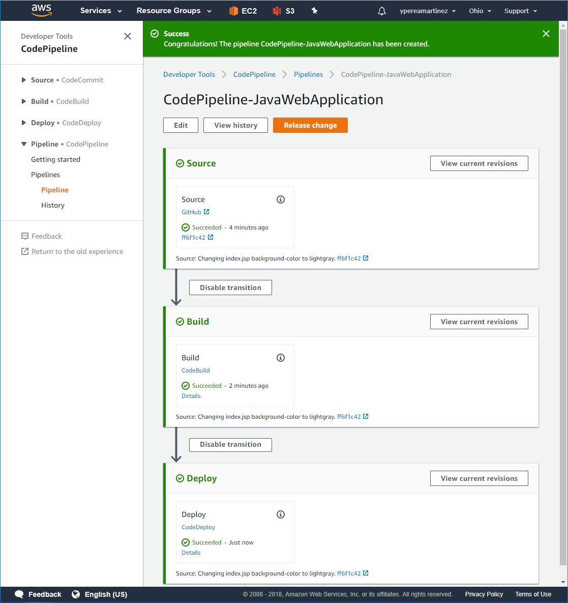
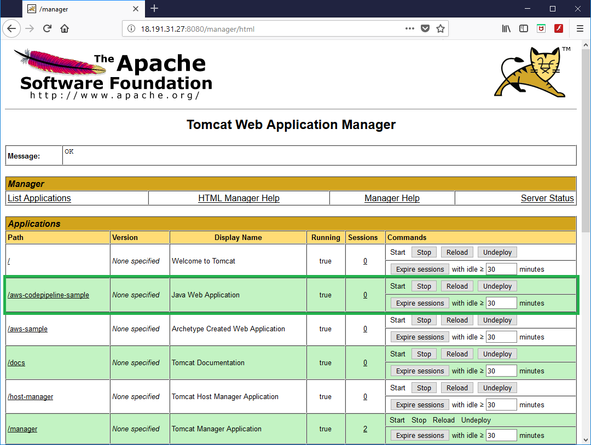
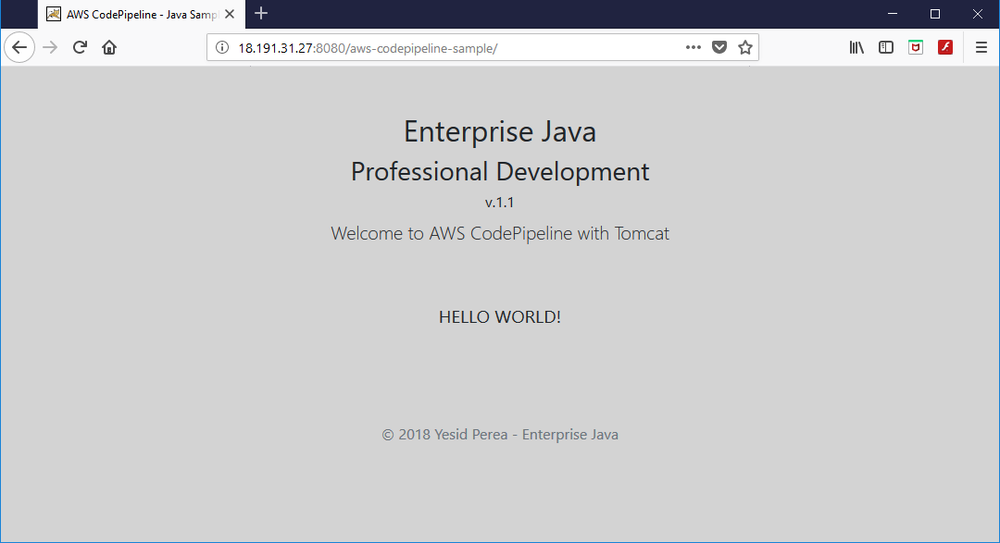
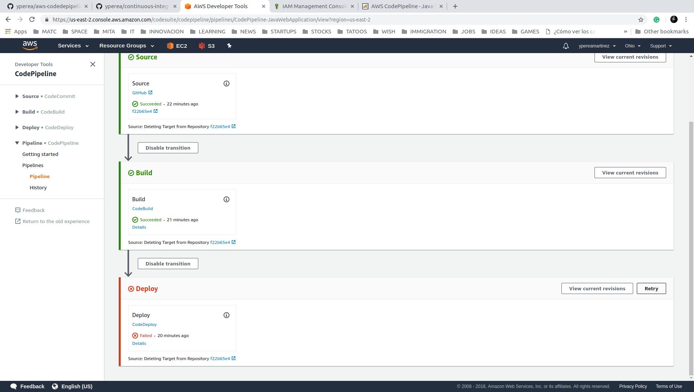
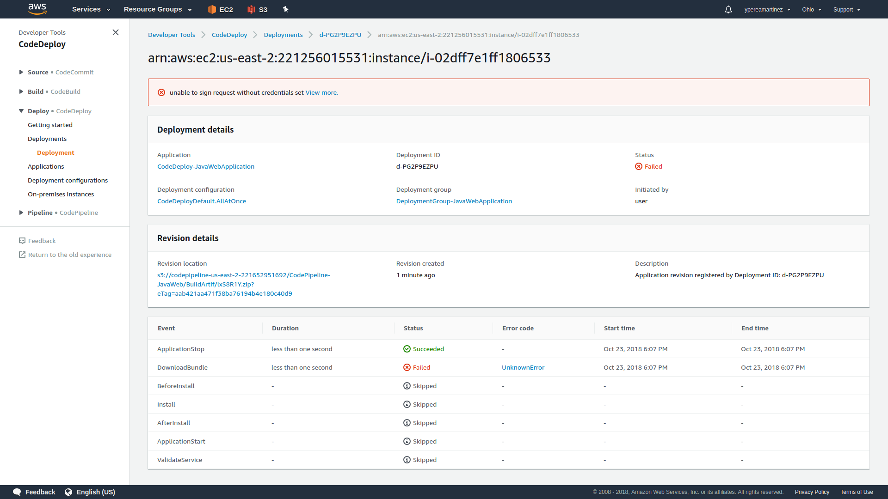
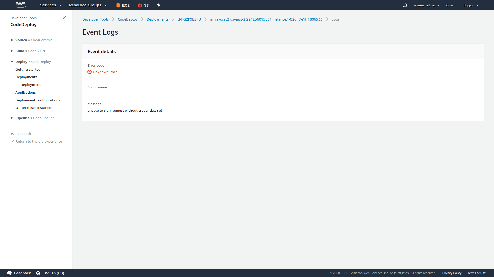

# AWS CodePipeline Setup Guideline

## Installation Steps

  1. Log into AWS.

  2. Search for the CodePipeline service and select it.

  3. In the Pipelines pane, click on **Create pipeline**.

  4. **Step 1 - Choose pipeline settings**. Enter the *Pipeline name*. Choose **New service role** option to create a new service role in your account, then select **Default location** as Artifact store and click **Next** to continue.

  5. **Step 2 - Add source stage**. Select **GitHub** as Source provider then click on **Connect to GitHub** and provide your credentials in case they are required.

  Once you have been authenticated choose the Repository and Branch that will be the source for the process. Leave GitHub webhooks option checked.

  6. **Step 3 - Add build stage**. Select **AWS CodeBuild** as your Build provider. Click on **Create project**, this will send you to the CodeBuild process.

  - [ ] Enter a name for you Build Project.

  - [ ] In the Environment pane choose **Managed image** option and select *Ubuntu* as Operating system, *Java* as Runtime, *java:openjdk-8* for Runtime version and *Always use the latest image for this runtime version*. Then choose to create a new service role.

  - [ ] For Build specifications, choose *Use a buildspec file*, which will be the buildspec.yaml file in our project. Click **Continue to CodePipeline** to return to the pipeline setup process.

  - [ ] Once you are in the **Add build stage** screen, click **Next**.

   7. **Step 4 - Add deploy stage**. Select AWS CodeDeploy as your Deploy provider and select the rest of parameters according to your CodeDeploy Application. If there is not any CodeDeploy Application follow the steps described in the [CodeDeploy Setup Guideline](CodeDeploySetup.md).

   8. **Step 5 - Review**. Click Next and check that the information entered is correct.

  - [ ] Check Pipeline Settings.

  - [ ] Check Source Code Settings.

  - [ ] Check Build and Deploy Settings.

   9. Finally, click **Create Pipeline**.

This should trigger the process which you can follow in the Application CodePipeline pane.

Once process has successfully finished navigate to your tomcat manager site on you EC2 Instance and verify that the new application has been deployed.

Click on it and visualize your application running.

Each time you commit/push a new code change to your repository, CodePipeline will automatically release this change in your instance.

## Troubleshooting

### **Unable to sign request without credentials set**

During Deployment things could go wrong, fortunately AWS gives pretty good hints about the possible error causes.

1. After a failed Deployment you can check the events by clicking on *Details* link on **Deploy** section.

  2. The event list will show you the source of the error. For this particular example we can see that an error occurred during the **DonloadBundle** process. The next step is click on the UnknownError link to view the detail of this error.

  3. **Event Details Message** describes the cause of the error.

**Unable to sign request without credentials set** is one of the most common error during a Deployment process, this is because there isn't a role attached to the EC2 instance that allows this operation.

To fix it click on the following link [Setup an EC2 Role for AWS CodePipeline Deployment](CreateEC2RoleForAWSCodePipeline.md)
