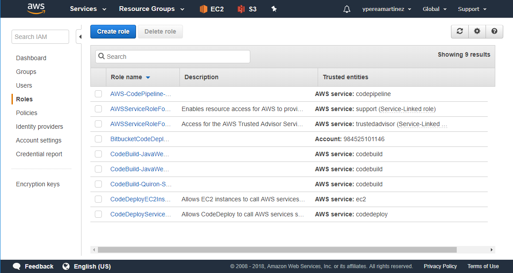
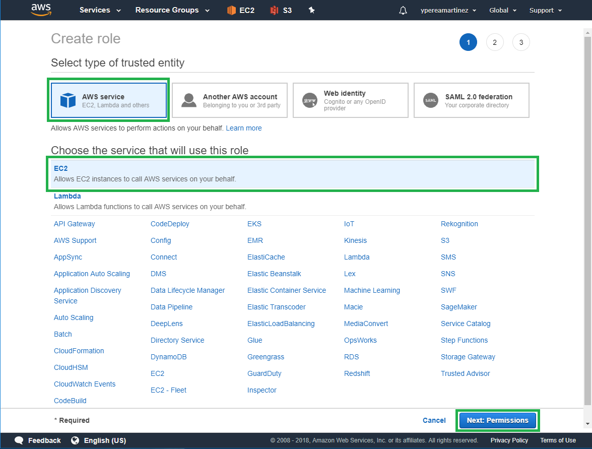
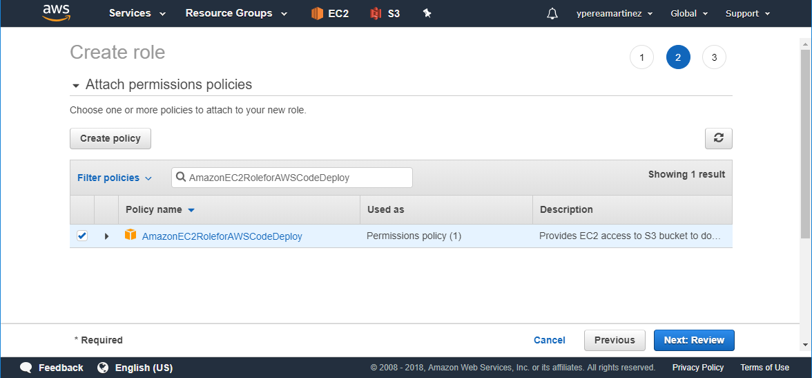
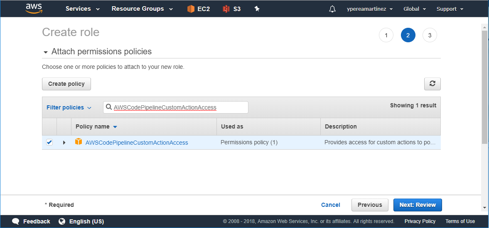
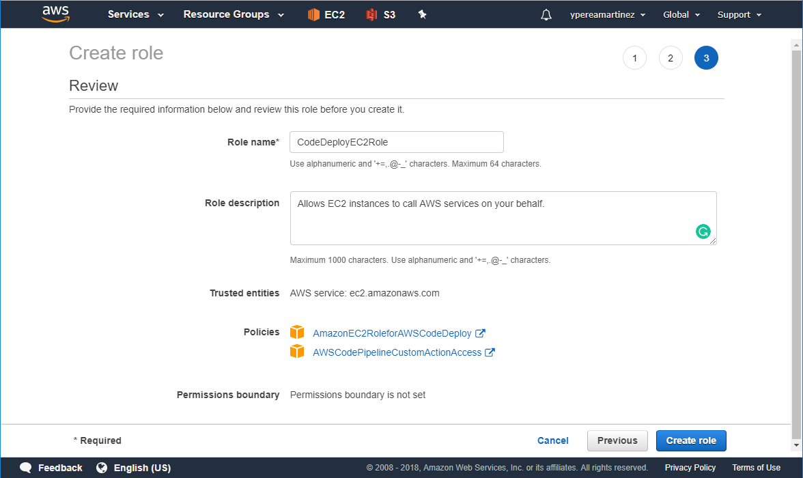
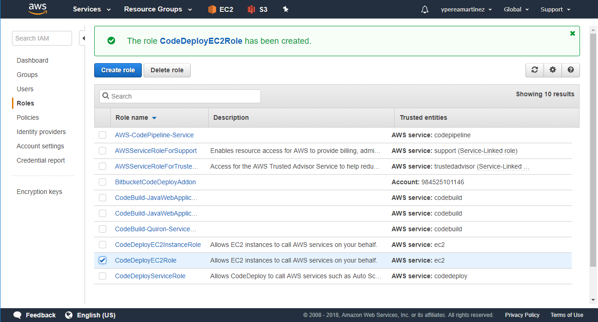
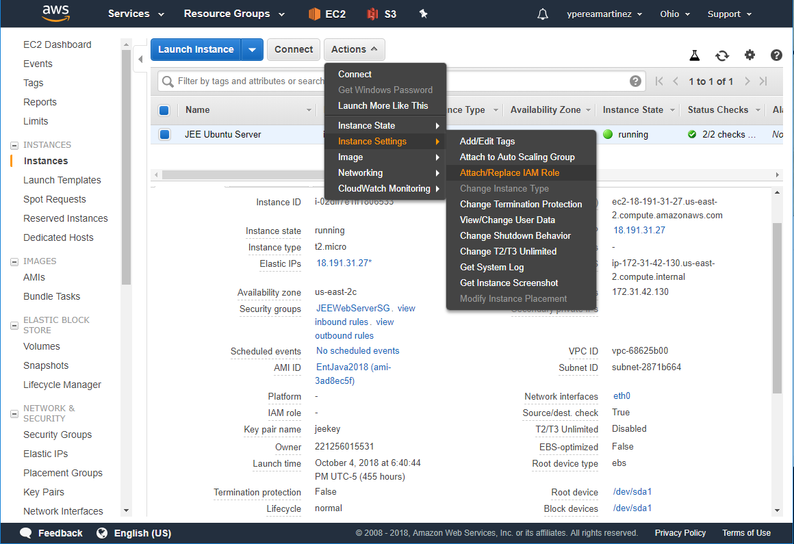
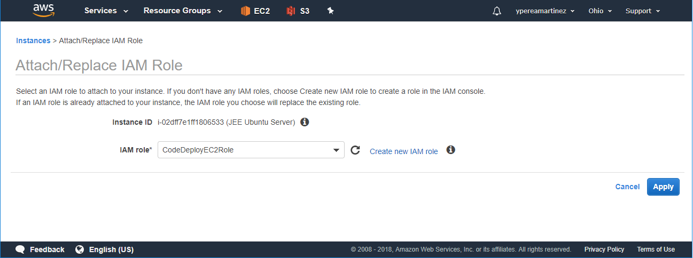
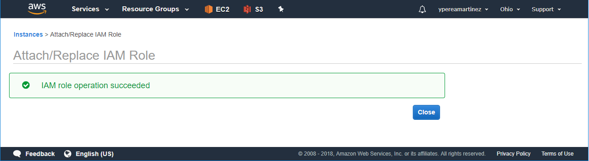

# EC2 Role for AWS CodePipeline and AWS CodeDeploy Setup

## Steps

1. Log into AWS.

2. Search for the **IAM** service and select it.

3. In option Roles click **Create Role**:

4. Select **AWS service** as type of trusted entity and **EC2** for the service that will use the role, then click **Next: Permissions**.

5. Select and attach to the role the predefined polices **AmazonEC2RoleforAWSCodeDeploy** and **AWSCodePipelineCustomActionAccess**, then click **Next: Review**.

6. Review that both polices were attached and assign a name for the role, then click **Create role**.

7. Verify on Roles pane the creation of the new Role.

8. Return to EC2 Dashboard and select **Actions** > **Instance settings** > **Attach/Replace IAM Role** option.

9. Finally select the Role just created and click **Apply**.

This role enable AWS CodePipeline to deploy artifacts on the EC2 Instance selected.

